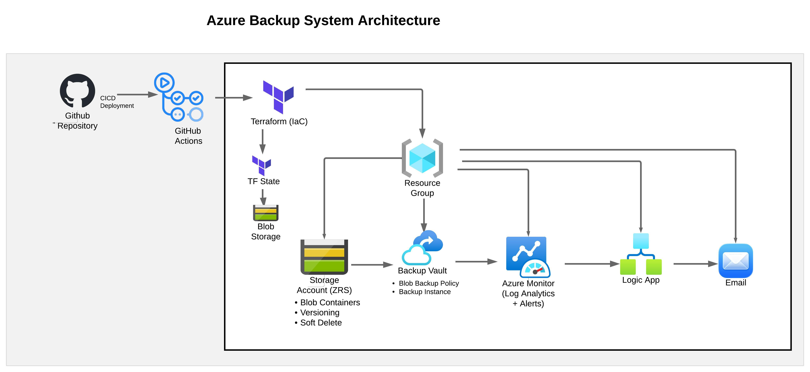

# Azure Backup System (Terraform + AzAPI)

This project provisions an Azure Blob backup solution using Terraform.

## Architecture
## Architecture

- Storage Account + Blob Container
- Backup Vault
- Backup Policy (Portal)
- Backup Instance (Terraform via AzAPI)
- Role Assignment

## Tech Stack
- Terraform
- AzureRM Provider
- AzAPI Provider

## Key Learnings
- Handling unsupported Azure resources with AzAPI
- Debugging Azure API errors
- Modular Terraform design